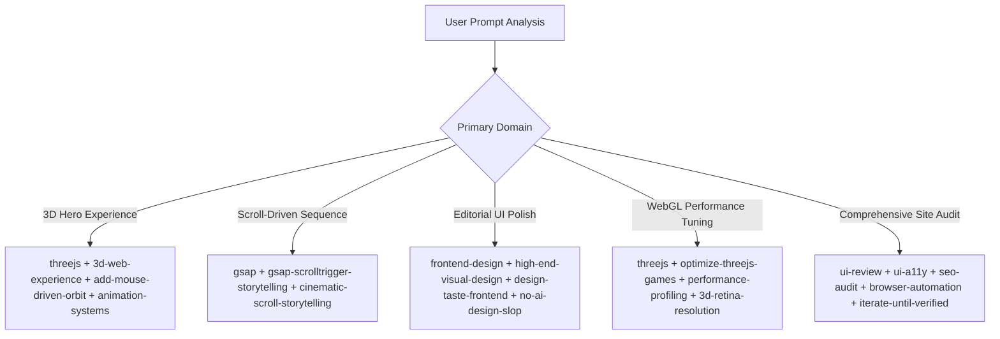

# Demaze Frontend Orchestrator

This skill is the central routing and orchestration system for the **Demaze Technologies** codebase. Its mission is to eliminate manual skill management by autonomously determining, combining, and executing the exact specialized skills required for any frontend, 3D, animation, UI/UX, performance, or audit task.

---

## 1. Core Operating Principles

1. **Autonomous Skill Determination**: Never ask the user *"Which skill should I use?"* or expect them to invoke skills manually. Analyze the task, identify the relevant domains, and pull in the required skill instructions immediately.
2. **Minimal & Precise Activation**: Prefer the smallest cohesive combination of skills (typically 2–4) that thoroughly covers the problem space. Do not load unrelated skills simply because they are available.
3. **Multi-Domain Synthesis**: When a task bridges disciplines (e.g., a Three.js hero with GSAP scroll storytelling and responsive mobile layout), synthesize the relevant domain skills together.
4. **Preserve Architectural Invariants**: Inspect the existing implementation before writing code. Respect the existing stack (Vanilla JS / SSR Framer / CSS modules / local Lenis / Three.js) and never refactor working architecture merely because a generic framework guide recommends it.
5. **Quality & Verification**: Never consider a task finished when code compiles. Visually and programmatically verify the running application across desktop, tablet, and mobile breakpoints using browser automation tools before reporting completion.

---

## 2. Skill Catalog & Domain Classification

When evaluating incoming tasks, route against this categorized ecosystem:

| Domain | Available Skills | Primary Trigger Keywords / Concepts |
| :--- | :--- | :--- |
| **Frontend Core & Architecture** | `frontend-developer`, `frontend-design`, `nextjs-app-router-patterns`, `react-best-practices`, `shadcn`, `tailwindcss`, `tailwind-patterns`, `mobile-design`, `performance-profiling` | Layout, React, Next.js, components, state, responsive, breakpoints, Tailwind, bundle size, hydration |
| **3D, WebGL & Shaders** | `threejs`, `3d-web-experience`, `webgl-3d-object`, `webgl-landing-steering`, `webgl-laser`, `globe-gl`, `globe-particles`, `cobejs`, `add-mouse-driven-orbit`, `3d-high-poly-models`, `3d-high-resolution-textures`, `3d-retina-resolution`, `3d-sky-background`, `3d-sky-rays`, `3d-falling-leaves`, `3d-four-seasons`, `3d-virtual-tour`, `build-wireframe-scan-reveal`, `shaders-cursor-ripples`, `vantajs`, `unicorn-studio` | Three.js, WebGL, canvas, particle sphere, 3D model, mesh, shader, GLSL, raymarching, orbit, camera, textures |
| **Motion, Animation & Scroll** | `animation-systems`, `cinematic-gsap-lenis-motion-system`, `cinematic-scroll-storytelling`, `gsap`, `gsap-scrolltrigger-storytelling`, `scroll-experience`, `scroll-progress-timeline`, `scroll-scrubbed-visual-sequence`, `scroll-scrubbed-word-reveal`, `staggered-word-reveal`, `masked-reveal`, `animation-on-scroll`, `marquee-loop`, `reveal-hover-effect`, `beam-glow-states`, `liquid-metal-border`, `thinking-orbs`, `ambient-section-particles`, `build-interactive-particle-trail`, `matterjs` | GSAP, ScrollTrigger, Lenis, smooth scroll, scrub, unfolding, staggers, hover effects, particles, physics |
| **Design Taste & Layouts** | `design-system`, `design-taste-frontend`, `high-end-visual-design`, `no-ai-design-slop`, `audit-ai-design-slop`, `framed-grid-layout`, `container-lines`, `corner-diagonals`, `corner-lasers`, `css-border-gradient`, `css-alpha-masking`, `progressive-blur`, `beautiful-shadows`, `nested-container-clean-agency`, `split-layout-technical`, `technical-wireframe-info-layout`, `bright-green-tech-system-webgl`, `editorial-portfolio-chapters`, `editorial-tech`, `number-details` | Editorial, luxury tech, glassmorphism, gradients, borders, shadows, layout grids, spacing, aesthetic polish |
| **Product & Conversion** | `landing-page`, `product-proof-saas`, `operational-enterprise-ai`, `interactive-portfolio`, `form-cro`, `canvas-design`, `video-to-superprompt`, `html-to-interaction-prompts`, `design-first-ui-prompting`, `daily-ui-inspiration-capture`, `build-daily-inspiration-sites` | Hero conversions, CTA banners, feature grids, enterprise trust, case studies, form optimization |
| **QA, Audits & Accessibility** | `ui-review`, `ui-a11y`, `accessibility-compliance-accessibility-audit`, `seo-audit`, `browser-automation`, `stitched-full-page-capture`, `audit-reference-originality`, `iterate-until-verified` | Visual audit, console errors, WCAG, ARIA, screen readers, SEO meta, Puppeteer, full-page screenshots |
| **Creative Assets & Tools** | `unsplash-asset-images`, `aura-asset-images`, `company-logos`, `solar-duotone-bold`, `publish-project-to-github` | Stock images, logo vectors, icon sets, GitHub releases |
| **3D Web Performance** | `optimize-threejs-games` | Draw calls, GPU pressure, memory leaks, texture budgets, frame drops |
| **Antigravity Customizations** | `antigravity-guide`, `agy-customizations`, `skill-repair` | Rules, skills, hooks, workflows, IDE features |

---

## 3. Autonomous Decision & Pairing Matrix

Apply these standard multi-skill combinations automatically based on task intent:

### Specific Pairing Recipes

#### 1. "Build or refine a cinematic 3D hero"
* **Skills**: `frontend-developer` + `threejs` + `3d-web-experience` + `webgl-landing-steering` + `animation-systems` + `gsap` + `cinematic-gsap-lenis-motion-system` + `performance-profiling`
* **Focus**: Hero typography, floating glass navbar, atmospheric background blending, GPU particle limits, and smooth mouse orbit parallax.

#### 2. "Make the hero react to mouse movement"
* **Skills**: `threejs` + `add-mouse-driven-orbit` + `3d-web-experience` + `animation-systems` + `frontend-developer`
* **Focus**: Damped pointer tracking, smooth lerp interpolation, look-at splitting, and mobile touch fallback.

#### 3. "Make this section animate / unfold as I scroll"
* **Skills**: `gsap` + `gsap-scrolltrigger-storytelling` + `cinematic-scroll-storytelling` + `scroll-experience` + `scroll-scrubbed-visual-sequence` + `animation-systems`
* **Focus**: Lenis scroll synchronization, sticky card progression, staggered typography reveals, and scrubbed progress math.

#### 4. "Create a high-end editorial or enterprise section"
* **Skills**: `frontend-design` + `high-end-visual-design` + `design-taste-frontend` + `editorial-tech` + `design-system` + `no-ai-design-slop`
* **Focus**: Crisp monospaced badges, restrained contrast, balanced multi-column grids, elimination of generic AI gradients, and high-impact typography.

#### 5. "Optimize 3D scene / fix frame drops / stuck scroll"
* **Skills**: `threejs` + `optimize-threejs-games` + `3d-retina-resolution` + `performance-profiling` + `react-best-practices`
* **Focus**: Draw call reduction, geometry instancing, texture mipmapping, DPR clamp (`Math.min(window.devicePixelRatio, 2)`), and ensuring `scroll-behavior: auto` when Lenis is active.

#### 6. "Audit and fix website issues"
* **Skills**: `ui-review` + `ui-a11y` + `accessibility-compliance-accessibility-audit` + `seo-audit` + `browser-automation` + `iterate-until-verified`
* **Focus**: Puppeteer headless verification, console error logging, contrast checks, keyboard navigation, meta tags, and responsive viewport checks (1440px, 768px, 390px).

---

## 4. Pre-Implementation Execution Protocol

Before making changes, execute this internal checklist:

1. **Domain Assessment**:
   - What category does this request belong to? (3D, scroll motion, UI polish, layout fix, performance, QA).
   - Does this task require 3D rendering or canvas manipulation?
   - Does it involve scroll-linked or hover-driven animation?
   - Do performance budgets apply (draw calls, RAF overhead, memory)?
   - Are accessibility (WCAG / `prefers-reduced-motion`) and SEO affected?
2. **Current State Inspection**:
   - Inspect the live DOM and rendered styles using browser tools or headless scripts.
   - Check existing script overrides in `demaze/` and styles in `assets/demaze/`.
   - Identify potential conflicts (e.g., CSS `scroll-behavior: smooth` fighting Lenis).
3. **Selected Skill Activation**:
   - Load instructions for the 2–4 identified skills from `.agents/skills/` or `~/.gemini/config/skills/`.
   - Follow the specific patterns (e.g., easing curves from `cinematic-gsap-lenis-motion-system`, shadow tokens from `beautiful-shadows`).

---

## 5. Demaze Engineering & Aesthetic Guardrails

* **Aesthetic Standard**: Demaze designs must feel distinct, state-of-the-art, and editorial. Never accept generic AI templates, centered blue gradients, or uncalibrated margins.
* **Moviq Benchmark**: Match Moviq's high-fidelity benchmarks: frosted glass floating navbars, signature easing (`cubic-bezier(.22, 1, .36, 1)`), dark slate elevations (`rgba(15,23,42,0.75)`), and smooth particle atmospheres.
* **Three.js / WebGL Guardrails**:
  - Always clamp device pixel ratio: `renderer.setPixelRatio(Math.min(window.devicePixelRatio, 2))`.
  - Always clean up geometries, materials, and textures on unmount/route change.
  - Never run unthrottled raycasters on raw `mousemove`; use passive damped targets.
* **Scroll & Motion Guardrails**:
  - Never pair native CSS `scroll-behavior: smooth` with Lenis or GSAP ScrollTrigger.
  - Wrap animations in `@media (prefers-reduced-motion: reduce)` fallbacks.
* **Responsive Guardrails**:
  - Provide safe bottom spacing (`padding-bottom: 120px`) whenever fixed floating pill navbars are active on mobile viewports.
  - Never allow text or headers to wrap character-by-character; enforce `white-space: nowrap !important; width: max-content !important;` on uppercase badges and menu titles.

---

## 6. Post-Implementation Verification & Reporting

1. **Programmatic Audit**: Run automated headless Puppeteer checks across routes (`/`, `/projects`, `/services`, `/about-us`, `/contact`).
2. **Console & Scroll Integrity**: Verify zero console errors, smooth scroll progression from `scrollY = 0` to target depth, and active Lenis instance.
3. **Visual Confirmation**: Capture screenshots of desktop (1440px), tablet (768px), and mobile (375px/390px) to verify alignment, padding, and absence of collisions.
4. **Completion Report**: Summarize changes, audited routes, test outcomes, and modified files clearly for the user.
